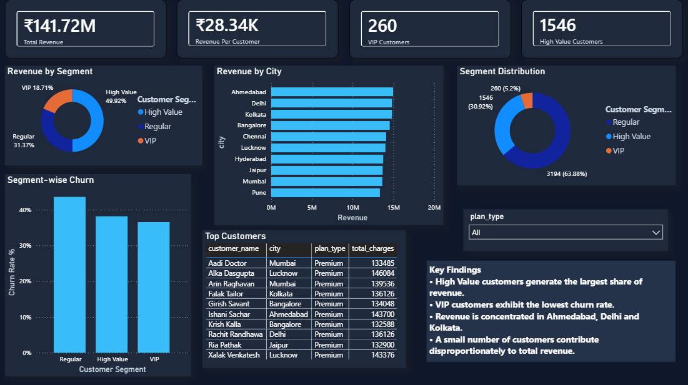

# Customer Churn Analytics Dashboard

An end-to-end churn analysis covering **5,000 customers**, built as a linear workflow:

```text
Dataset Generation (Python) → SQL Analysis → Business Insights → Power BI Dashboard
```

---

## Overview

Subscription churn is where most retention revenue is lost, but the drivers are rarely obvious from raw records alone. This project loads a customer base into MySQL, runs forty analytical queries across four business themes, turns the results into a narrative, and lands it in a four-page interactive dashboard.

The analysis answers four questions:

- **Why** do customers churn?
- **Which** customer groups generate the most revenue?
- **Which** segments carry the highest risk?
- **What** business levers actually move retention?

---

## Key Results

| Metric | Value |
| --- | --- |
| Total Customers | 5,000 |
| Total Features (columns) | 15 |
| Churned Customers | 2,077 |
| Churn Rate | 41.54% |
| Total Revenue | ₹141.72 Million |
| Revenue At Risk | ₹54.82 Million (38.69% of revenue) |
| Avg Revenue Per Customer | ₹28,343 |
| Avg Monthly Charges | ₹942.98 |
| Avg Satisfaction Score | 2.96 |

Nearly ₹55 in every ₹141 of lifetime revenue sits with customers who have already left. That is the number the dashboard is built to shrink.

### Customer Segments

Segments are derived from `total_charges` using thresholds in `customer_segmentation.sql`.

| Segment | Customers | Revenue | Revenue Share | Churned | Churn Rate |
| --- | --- | --- | --- | --- | --- |
| Regular | 3,194 | ₹44.46M | 31.37% | 1,392 | 43.58% |
| High Value | 1,546 | ₹70.75M | 49.91% | 590 | 38.16% |
| VIP | 260 | ₹26.51M | 18.71% | 95 | 36.54% |

---

## Key Business Insights

- **Contract length is the single strongest predictor.** Monthly contracts churn at **53.42%**, while Yearly (**30.00%**) and Two Year (**30.14%**) sit roughly 23 points lower. Retention is bought with commitment.
- **Low satisfaction is a reliable warning sign.** Customers scoring below 3 churn at **56.33%**, versus **26.84%** for scores of 3 to 4 and **26.18%** for 4 and above. Churned customers average 2.60 satisfaction against 3.22 for retained ones.
- **Support load compounds the problem.** Customers with 8 or more tickets churn at **52.93%**, compared to **29.94%** for those with 3 or fewer. Churned customers filed 8.82 tickets on average versus 6.67 for retained ones.
- **Plan type barely moves churn.** Basic (42.68%), Standard (40.15%), and Premium (42.03%) are within a few points of each other, so upselling alone will not fix retention.
- **Gender and price are not differentiators.** Female churn is 42.77% against 40.32% for male, and churned customers actually pay slightly *less* (₹936.22 vs ₹947.78). Neither gap is large enough to act on.
- **Revenue is concentrated but not fragile.** The 1,806 High Value and VIP customers (36% of the base) generate **68.63%** of revenue. VIP churn is lowest of all segments at 36.54%.
- **Low-satisfaction customers hold the most revenue.** The sub-3 satisfaction band accounts for ₹70.03M of lifetime revenue, more than the high-satisfaction band (₹36.37M) — improving satisfaction protects spend that is already being lost.
- **Churn is evenly spread across ages.** Every age band from 18-24 to 55+ falls between 40.25% and 43.03%, ruling out age as a useful targeting dimension.

---

## Tech Stack

- **SQL (MySQL)** — schema design, conditional aggregation, window functions
- **Python (Pandas, NumPy)** — synthetic dataset generation and quality checks
- **Power BI** — data modeling, DAX measures, interactive dashboards
- **Git & GitHub** — version control

---

## Project Structure

```text
Customer_Churn_Dashboard/
│
├── Customer_churn_Analytics.pbix
│
├── datasets/
│   └── customers.csv
│
├── Screenshots/
│   ├── Page1_Executive_Overview.png
│   ├── Page2_Churn_Intelligence.png
│   ├── Page3_Customer_Segmentation.png
│   └── Page4_Advanced_Churn_Intelligence.png
│
├── sql_queries/
│   ├── database_setup.sql
│   ├── executive_overview.sql
│   ├── churn_analytics.sql
│   ├── customer_segmentation.sql
│   └── advance_churn_intelligence.sql
│
├── dataset_generation/
│   └── Customer-Churn-Creation.ipynb
│
└── README.md
```

---

## SQL Analysis

The analysis is split into five business-focused modules across four SQL files. `database_setup.sql` creates the database and table; the three files after it cover the remaining modules.

### 1. Executive Overview — `executive_overview.sql`

Headline KPIs plus the distributions that frame them.

- Total Customers, Churned Customers, Churn Rate
- Total Revenue, Average Revenue Per Customer, Revenue At Risk
- Customers By Plan, Customers By Contract
- Average Satisfaction, Average Monthly Charges

### 2. Churn Analytics — `churn_analytics.sql`

Where churn concentrates, and which signals travel with it.

- Churn by Plan Type, Contract Type, Gender, Payment Method
- Top 10 Cities by Churn
- Satisfaction vs Churn, Support Tickets vs Churn, Monthly Charges vs Churn
- Revenue Lost by Plan, Top 10 High-Risk Customers

### 3. Customer Segmentation — `customer_segmentation.sql`

Value tiers and how each one behaves.

- Customer Segmentation, Segment Revenue Contribution
- Segment-wise Churn Rate, Segment Distribution
- Top 10 Most Valuable Customers, Customer Lifetime Value
- Top Cities by Revenue, Plan-wise Revenue Contribution
- Average Tenure by Churn, Churn by Age Group

### 4. Revenue Analysis

Folded into the segmentation and advanced modules rather than kept separate.

- Revenue by City, Revenue by Plan Type
- Top Revenue Generating Customers, Revenue Distribution Analysis

### 5. Advanced Churn Intelligence — `advance_churn_intelligence.sql`

Revenue risk and ranked customer extraction using window functions.

- Revenue Ranking by City (`RANK() OVER`)
- Top Customer in Each City (`ROW_NUMBER() OVER PARTITION BY`)
- Customer Revenue Quartiles (`NTILE(4)`)
- Churn Revenue Contribution, Revenue Lost by Contract Type
- Revenue by Satisfaction Category, Churn Rate by Satisfaction Category
- Support Ticket Categories, Executive Summary KPI

---

## Power BI Dashboard

Four interactive pages, each answering one layer of the question.

### Page 1 — Executive Overview

- KPI Cards
- Churn Distribution
- Revenue by Plan Type
- Customers by Contract Type
- Top Cities by Revenue


---

### Page 2 — Churn Intelligence

- Churn Rate by Contract Type
- Churn by Plan Type
- Satisfaction vs Churn
- Support Tickets vs Churn
- Churn by Payment Method


---

### Page 3 — Customer Segmentation & Revenue Analysis

- Revenue by Segment
- Segment Distribution
- Revenue by City
- Segment-wise Churn
- Top Customers Analysis



---

### Page 4 — Advanced Churn Intelligence

- Revenue At Risk
- Churn by Age Group
- Satisfaction Segment Analysis
- Revenue Risk by Plan Type
- Top Revenue Risk Customers


---

## Skills Demonstrated

### SQL

- Conditional aggregation with `SUM(CASE WHEN ...)`
- `CASE` bucketing for segments, age groups, satisfaction and ticket bands
- Window functions: `RANK()`, `ROW_NUMBER() ... PARTITION BY`, `NTILE(4)`
- Common table expressions (`WITH`) for per-city top-customer extraction
- Percentage-of-total via correlated scalar subqueries
- Aggregation, grouping, and ordered limiting

### Python

- Synthetic data generation with Pandas and NumPy
- Data export to CSV
- Data quality checks (`info`, `describe`, `isnull().sum()`)

### Power BI

- Data modeling
- DAX measures
- Interactive dashboards
- KPI design
- Business storytelling

---

## Technical Details

### Dataset Schema

`datasets/customers.csv` — 5,000 rows, 15 columns, generated by `dataset_generation/Customer-Churn-Creation.ipynb`.

| Column | Type | Notes |
| --- | --- | --- |
| `customer_id` | INT | Primary key |
| `customer_name` | VARCHAR(100) | |
| `gender` | VARCHAR(20) | Male / Female |
| `age` | INT | Range 18-65 |
| `city` | VARCHAR(50) | 10 cities |
| `join_date` | DATE | 2021-06-19 to 2026-06-19 |
| `tenure_months` | INT | |
| `plan_type` | VARCHAR(30) | Basic / Standard / Premium |
| `monthly_charges` | DECIMAL(10,2) | |
| `total_charges` | DECIMAL(12,2) | Lifetime revenue, up to ₹146,084 |
| `contract_type` | VARCHAR(30) | Monthly / Yearly / Two Year |
| `payment_method` | VARCHAR(50) | UPI / Credit Card / Debit Card / Wallet / Net Banking |
| `support_tickets` | INT | 0-15 |
| `satisfaction_score` | DECIMAL(3,1) | 1.0-5.0 |
| `churn` | VARCHAR(10) | Yes / No |

### Segment Definitions

| Segment | Rule |
| --- | --- |
| VIP | `total_charges >= 80000` |
| High Value | `total_charges >= 30000` |
| Regular | otherwise |

### Satisfaction and Ticket Bands

| Band | Rule |
| --- | --- |
| High Satisfaction | `satisfaction_score >= 4` |
| Medium Satisfaction | `satisfaction_score >= 3` |
| Low Satisfaction | otherwise |
| Low Tickets | `support_tickets <= 3` |
| Medium Tickets | `support_tickets <= 7` |
| High Tickets | otherwise |

### Running the Analysis

Execute the SQL files in order against a MySQL instance:

```bash
mysql -u root -p < sql_queries/database_setup.sql
mysql -u root -p customer_churn_db < sql_queries/executive_overview.sql
mysql -u root -p customer_churn_db < sql_queries/churn_analytics.sql
mysql -u root -p customer_churn_db < sql_queries/customer_segmentation.sql
mysql -u root -p customer_churn_db < sql_queries/advance_churn_intelligence.sql
```

Load `datasets/customers.csv` into the `customers` table in MySQL, or connect Power BI directly to the CSV and reproduce the measures in DAX.

### Regenerating the Dataset

`dataset_generation/Customer-Churn-Creation.ipynb` builds `customers.csv` from scratch. It generates records, exports to CSV, and runs basic quality checks before the SQL layer picks it up.
